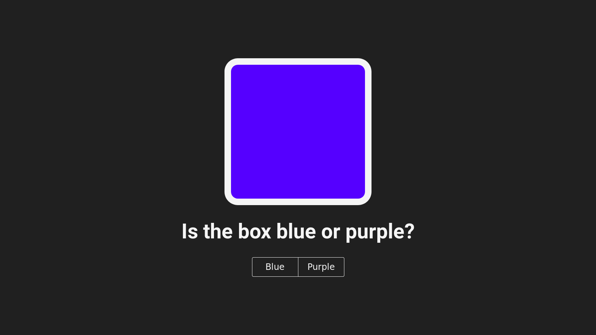

# Blueish

Is the box blue or purple?

[Demo](https://thatsokay.gitlab.io/blueish/)



Blueish tests how people name certain colours. Find out more about
[Colour Terms](https://en.wikipedia.org/wiki/Color_term).

## Building

Requires Node and npm.

```
npm install

# Run local server
npm start

# Build
npm run build
```
